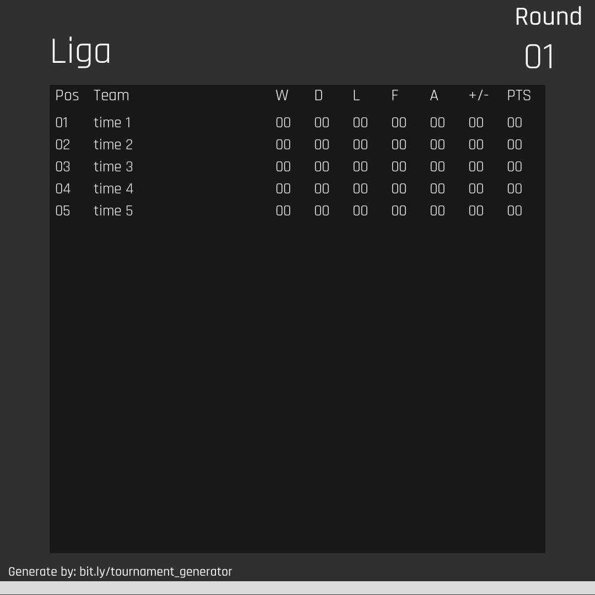

# Gerador de torneios - Django

Online no Heroku - [Tornament Generator](https://tournament-generator-w41.herokuapp.com)

Projeto criado após a conclusão da seção básica do curso de django da Geek University, tendo como intuito a prática e fixação do conteúdo. Nele é possível gerar torneios de pontos corridos ou fases eliminatórias, podendo também inserir os resultados das partidas até o fim do torneio. Opções de compartilhamento como link sem permissão de edição, e download de imagem do torneio também estão disponíveis.

# Tecnologias usadas
Para a construção do projetos usei Python/Django, com auxílio do javacript para alguns comportamentos e o Bootstrap para o visual.

  
  
  
  

# Screenshots

### Tela inicial

### Edição do torneio

### Share tournament

### Torneios eliminatórios

### Torneios de pontos corridos
*visão de visitante

